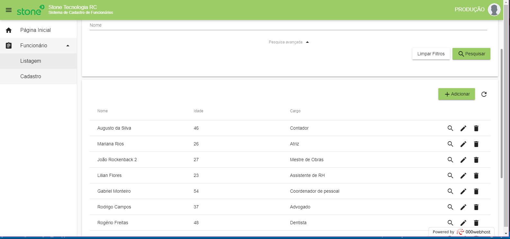

# Sistema de Cadastro de Funcionários
> Simples CRUD de funcionários. Desafio para a vaga de Desenvolvedor na Stone Tecnologia.


Sistema para gerenciamento de funcionários. Permite visualizar, cadastrar, alterar e excluir funcionários.
Trabalha com os seguintes dados: nome, idade, cargo



O sistema está acessível no endereço: [https://desafio-stone-frontend.000webhostapp.com/](https://desafio-stone-frontend.000webhostapp.com/)


## Pré-requisitos


- Interpretador Node v8+ junto com o NPM v6+
- Angular 5
- Servidor Apache ou Nginx(ambos são opcionais para ambiente de desenvolvimento)
- Browser atual


## Instalação e execução


**Windows, OS X & Linux:**

Baixe o arquivo zip e o descompacte ou baixe o projeto para sua máquina através do git clone [https://github.com/randercarlos/desafio-stone-frontend.git](https://github.com/randercarlos/desafio-stone-frontend.git)


- Entre no prompt de comando e vá até a pasta do projeto: 


```sh
cd ir-ate-a-pasta-do-projeto
```

- Instale as dependências do framework angular através do comando:

```sh
npm install
```

- Com as dependências instaladas, execute o comando:

```sh
ng serve -e local
```

- Se tudo der certo, o terminal exibirá uma mensagem que o projeto estará rodando no [http://localhost:4200](http://localhost:4200).


- Abra um navegador atual qualquer e execute o http://localhost:4200 para ver o projeto funcionando...


## Autor

Rander Carlos – randerccf@gmail.com
